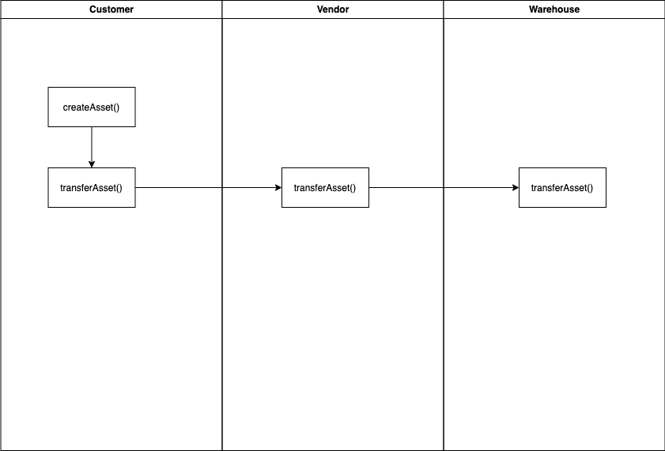
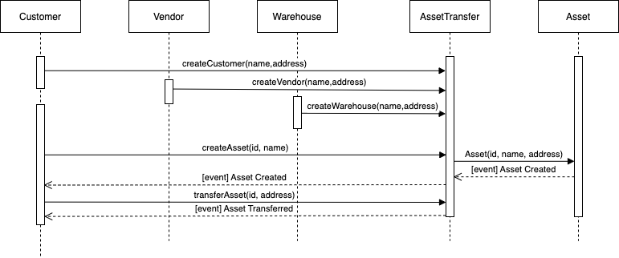

## AssetTracker

```
This repository contains a smart contract that tracks assets between participants.
```

The smart contract is written in solidity. The primary language used for writing smart contracts in ethereum.

Ethereum is the blockchain that would be used.

#### The following contracts are listed in this project:
* Asset.sol
* Customer.sol
* Vendor.sol
* Warehouse.sol
* AssetTracker.sol

## Getting Started

These instructions will get you a copy of the project up and running on your local machine for development and testing purposes. See deployment for notes on how to deploy the project on a live system.

### Prerequisites

Please make sure you've already installed ganache, ganache-cli, Truffle and enabled MetaMask extension in your browser.


* [Ganache](https://trufflesuite.com/ganache/)

* [Truffle](https://www.npmjs.com/package/truffle)

### Installing
A step by step series of examples that tell you have to get a development env running

Clone this repository:

```
$ git clone git@github.com:eetti/smu_mcda5540.git
```

```
$ cd smu_mcda5540
```

```
$ npm install -g truffle
```

```
$ truffle compile
```

```
$ truffle deploy
```


## Built With

* [Ethereum](https://www.ethereum.org/) - Ethereum is a decentralized platform that runs smart contracts
* [IPFS](https://ipfs.io/) - IPFS is the Distributed Web | A peer-to-peer hypermedia protocol
to make the web faster, safer, and more open.
* [Truffle Framework](http://truffleframework.com/) - Truffle is the most popular development framework for Ethereum with a mission to make your life a whole lot easier.


## Authors

See also the list of [contributors](https://github.com/your/project/contributors.md) who participated in this project.

## Acknowledgments

* Solidity
* Ganache-cli
* Truffle
* IPFS

## Version Numbers
- Truffle v5.4.24 (core: 5.4.24)
- Solidity - 0.8.10 (solc-js)
- Node v14.7.0
- Web3.js v1.5.3

## UML documents
### Activity

### Sequence

<!-- ### State

### Class (Data Model)
 -->